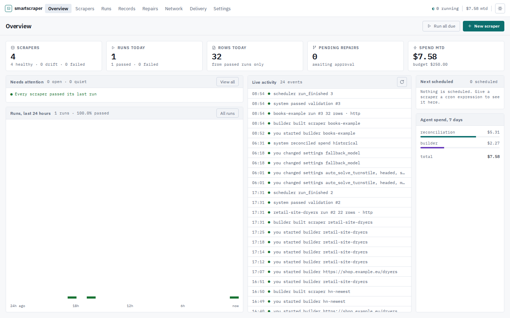
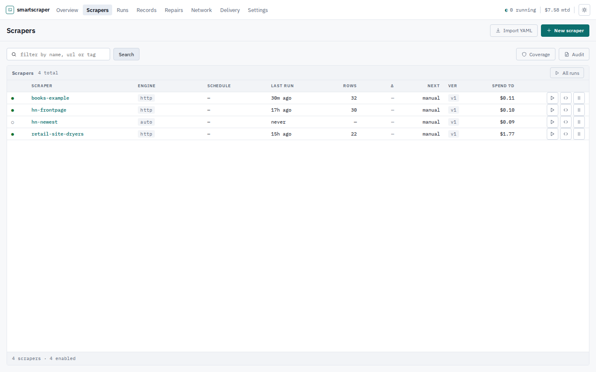
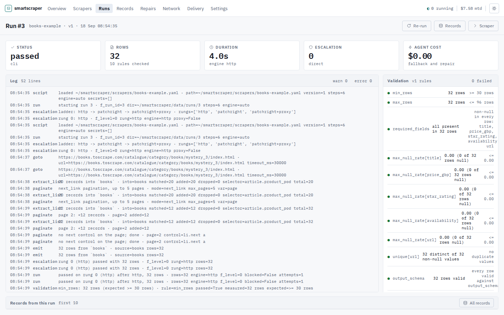
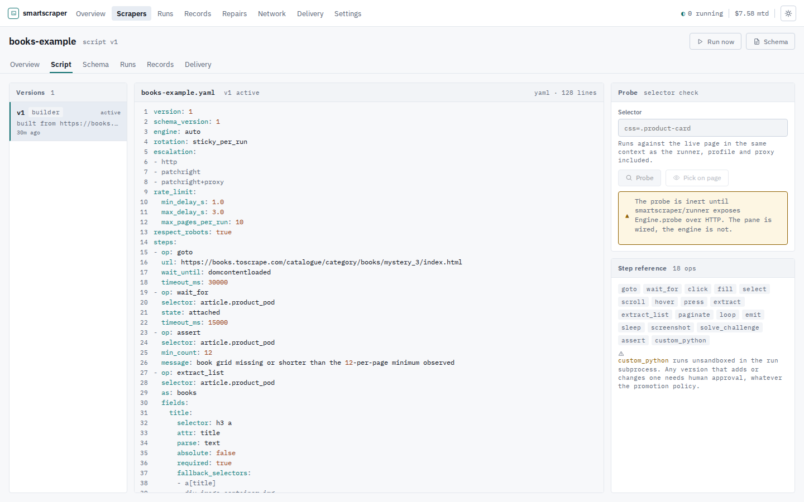
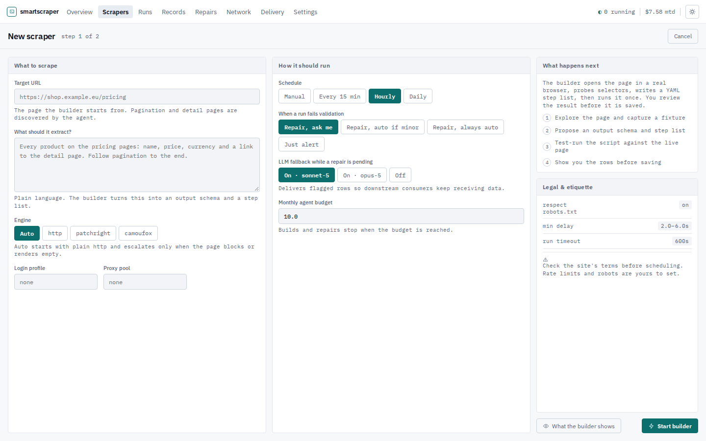

# SmartScraper

An agent writes the scraper once. After that a deterministic runner executes that
script on a schedule with no model in the loop, and the agent is called back only
when a run fails its own validation.

The point is a failure mode that exceptions do not catch. A scrape can succeed
technically and fail completely: every step runs, nothing raises, and the rows
come back quietly wrong because a selector now matches the wrong column. So a run
is judged on its output, not on whether it threw, and a run that fails is held
back from delivery rather than shipped.

<p align="center">
  
</p>

## How it works

```
  you: a URL and a sentence          the agent, once
        │                                  │
        ▼                                  ▼
  ┌───────────┐   explores, probes    ┌──────────┐
  │  builder  │──────────────────────▶│  YAML    │   a versioned step list,
  └───────────┘   selectors, tests    │  script  │   not free-form Python
                                      └────┬─────┘
                                           │
        every run after that, no model involved
                                           ▼
  ┌──────────┐    ┌────────────┐    ┌────────────┐    ┌──────────┐
  │  runner  │───▶│ validation │───▶│  delivery  │───▶│ webhook, │
  │ http or  │    │ schema,    │    │ held if it │    │ S3, MCP, │
  │ browser  │    │ nulls,     │    │ failed     │    │ files    │
  └──────────┘    │ row drift  │    └────────────┘    └──────────┘
                  └─────┬──────┘
                        │ failed
                        ▼
                  ┌───────────┐   proposes a new version, tests it,
                  │  repair   │   and waits for you unless the change
                  └───────────┘   is minor and you said auto
```

## What is in the box

- **A step language** rather than generated code. Eighteen operations the agents
  emit and repair. Free-form Python exists as one escape-hatch step that always
  needs human approval, whatever the promotion policy says.
- **An escalation ladder.** Plain HTTP first, then a patched Chromium, then a
  fingerprint-spoofing Firefox. It climbs only when the evidence says the engine
  is the problem, because a page the agent could not read will not read better
  from a stealthier browser.
- **Validation that decides.** Output schema, row-count drift against recent
  runs, per-field null rates, uniqueness. A run that passes every step and fails
  these is a failed run.
- **Delivery that holds.** Six sinks with retry. A failed run reaches only a
  target that opted into provisional rows.
- **An MCP server**, so any agent can list scrapers, trigger runs and read
  results, with freshness on the answer so a consumer can tell provisional data
  from clean data.
- **A web UI** of 21 working screens out of 23 designed, dense and built to be
  read at a glance rather than admired. The other two say what is missing.

## Running it

```bash
uv venv && uv pip install -e ".[dev]"
python -m playwright install chromium
cp .env.example .env          # set SS_ANTHROPIC_API_KEY at least
smartscraper init-db
smartscraper serve            # http://127.0.0.1:8088
smartscraper worker           # in another shell, for schedules
```

`smartscraper run <name>` executes one scraper in the foreground and prints the
verdict, naming any rule that failed with what was measured and what was
expected.

## Screens

<table>
<tr>
<td width="50%">

**Scrapers** — status, engine, schedule, spend, at a glance


</td>
<td width="50%">

**Run detail** — the log and the validation rules side by side


</td>
</tr>
<tr>
<td width="50%">

**Script editor** — the YAML, a selector probe against the live page, and the step reference


</td>
<td width="50%">

**New scraper** — a URL and a sentence in, a running build out


</td>
</tr>
</table>

## An example to read

`examples/books.yaml` was written by the builder, not by hand, against
[books.toscrape.com](https://books.toscrape.com/), a site that exists to be
scraped and says so on its own front page. Copy it into `scrapers/` and run it:

```bash
smartscraper init-db
smartscraper import examples/books.yaml
smartscraper run books
# run #1  passed  32 rows  http
#   32 rows, 10 of 10 rules passed
```

It is worth reading for the choices the agent made on its own. The star rating
is encoded in a CSS class rather than any text, so it reads the class attribute
and pulls the word out with a regex. Prices are parsed to numbers. Most fields
carry a second and third selector, so one markup change degrades instead of
breaking. There is an assertion before extraction, because fewer than twelve
cards means the page is not the one it was built against. And the validation
thresholds come from what was measured during the build rather than from
defaults.

## Two things to know before pointing it at a site

**It spends money when it thinks.** A build is one agent session and costs real
tokens; runs after that cost nothing. There is a monthly cap and a per-scraper
cap, and both are enforced before a browser opens.

**Scraping is your responsibility.** The tool respects `robots.txt` by default
and rate-limits itself, and both are per-scraper settings you can turn off. That
it *can* fetch a page is not the same as your being entitled to.

## Design notes

`PLAN.md` is the architecture and the reasoning behind each choice, including the
options rejected and why. `UI.md` is the interface spec: the token set, the
screen inventory and the rules the templates follow.

Both record what was measured and what was merely assumed. Where something is a
guess, it says so; the anti-bot marker table in particular is labelled unmeasured
in its own module, because it has never been tested against a corpus of real
challenge pages.

## Status

Sixteen hours old at the time of writing. Treat it accordingly.

**Exercised against live sites.** The builder has written working scrapers for
four real pages, including one that serves headless Chromium an HTTP 403 and a
bot-block interstitial. Each was re-run deterministically afterwards and returned
the same rows with every validation rule passing and no tokens spent.

**Verified by running, not by asserting.** A run with a third of its prices
missing is marked failed and held back from delivery, reaching only a target that
opted into provisional rows. Every control on every screen is reachable at five
viewport sizes, checked in a real browser.

**Never exercised, and you should know which parts.** The repair loop has never
fired on an actual site change: it is covered offline against a scripted agent,
and no selector has broken in the wild yet. The scheduler has never run a cron
cycle outside tests. No delivery has been sent to a real endpoint. A build has
never run on an API key rather than the credentials the Agent SDK finds for
itself.

So the deterministic half — build, run, validate, hold — has done real work. The
self-healing half is implemented and tested, and unproven.

**Unfinished pieces are named rather than hidden.** Two screens return an honest
"not built" page. Re-login needs a browser a person can see, so it does not work
on a headless host. There is no cron parser, so the schedule column shows the
expression rather than a countdown. And the anti-bot marker table is labelled
unmeasured in its own module, because it has never been tested against a corpus
of real challenge pages; only its blocked/not-blocked verdict is load-bearing.
